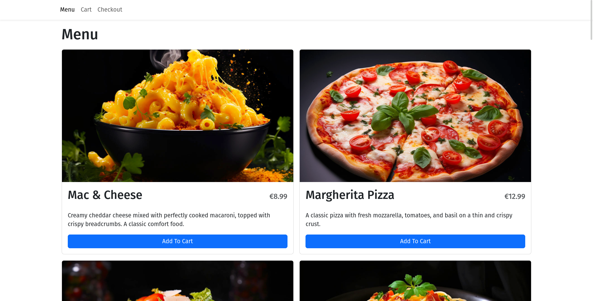
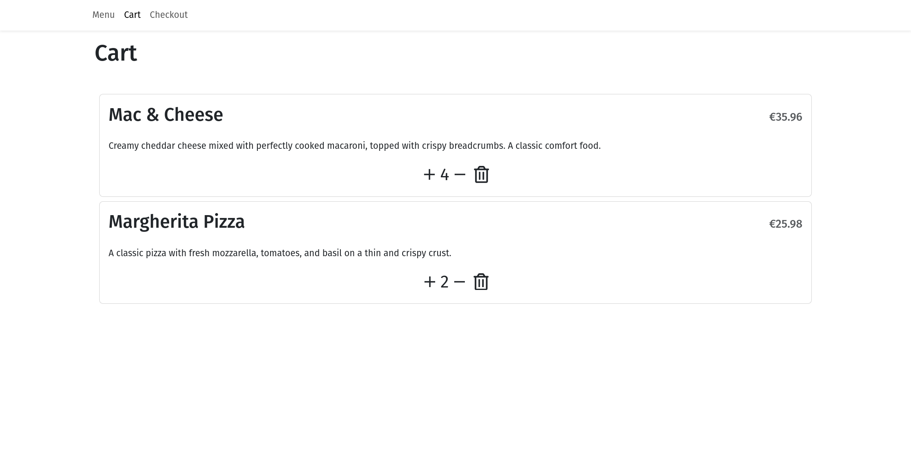
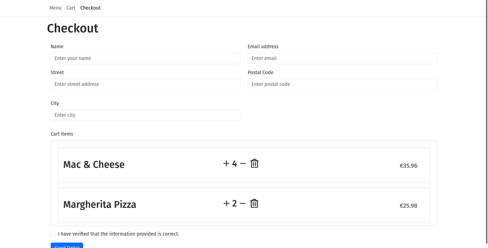

# Restaurant Ordering System

## Frontend

### Description

This part of the project is a React-based frontend for a restaurant ordering system. It provides users with a user-friendly interface to view the menu, add items to their cart, and place orders.

### Features

- **Menu Page:** Displays a list of dishes available for order.
- **Cart Page:** Shows the selected items in the cart with options to adjust quantities.
- **Checkout Page:** Allows users to enter their details and place an order.

## Backend

### Description

The backend of the restaurant ordering system is built with Node.js and Express. It handles requests related to dishes, orders, and serves as the server for the frontend.

### Features

- **Dishes Endpoint:** GET endpoint (`/api/dishes`) to retrieve a list of available dishes.
- **Orders Endpoint:**
  - GET endpoint (`/api/orders`) to retrieve a list of orders.
  - POST endpoint (`/api/orders`) to create a new order.
  - DELETE endpoint (`/api/orders`) to delete all orders.

# Demo

To try out the app, follow these steps:

1. Backend

The backend service deployed on *Render* may experience a brief delay when initially accessed due to automatic spinning down during idle periods. Follow these steps to access the backend:

Visit the backend service by clicking on [Backend Service Link](https://ordering-system-backend.onrender.com/api/dishes).

Please allow a few seconds for the service to spin up. You may experience a momentary delay, and the first request may take a bit longer.

2. Frontend

Once the backend is up and running, you can access the frontend to interact with the app. Follow these steps:

Visit the frontend app by clicking on [Frontend App Link](https://restaurant-ordering-app-uvyl.onrender.com/).
Enjoy testing the app!

Note: If you encounter any issues or experience delays, please refresh the page. The backend may take a moment to spin up if it's been idle.

# Screenshots

# Menu

# Cart

# Checkout
